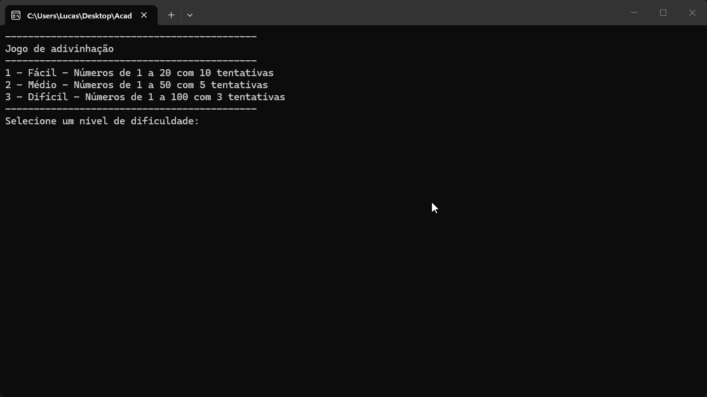

# Jogo de Adivinhação

## Projeto

Desenvolvido durante o curso Back-End da [Academia do Programador](https://www.academiadoprogramador.net) 2026

## Introdução

Um jogo de adivinhação de números que possuí seleção de três dificuldades, sistema de pontuação e validação de entradas do jogador.

## Como funciona

1. Clone ou baixe os arquivos do respositório.
2. Rode o arquivo ConsoleApp.exe dentro da pasta ConsoleApp > bin > Debug > ConsoleApp.exe.
3. Inicie o jogo selecionando um nível de dificuldade.
4. Chute as tentativas, o jogo te fornecerá dicas se você chutou abaixo ou acima do número aleatório secreto.
5. Sua pontuação começa em 1000 e dependendo do quão longe seu chute foi do número secreto sua pontuação é reduzida.

  * Se a diferença entre o número secreto e o palpite for de 10 ou mais, o jogador perde 100 pontos.
  * Se a diferença for entre 5 e 9, o jogador perde 50 pontos.
  * Se a diferença for entre 1 e 4, o jogador perde 20 pontos.

  ## Requisitos

  * .NET 10.0 SDK